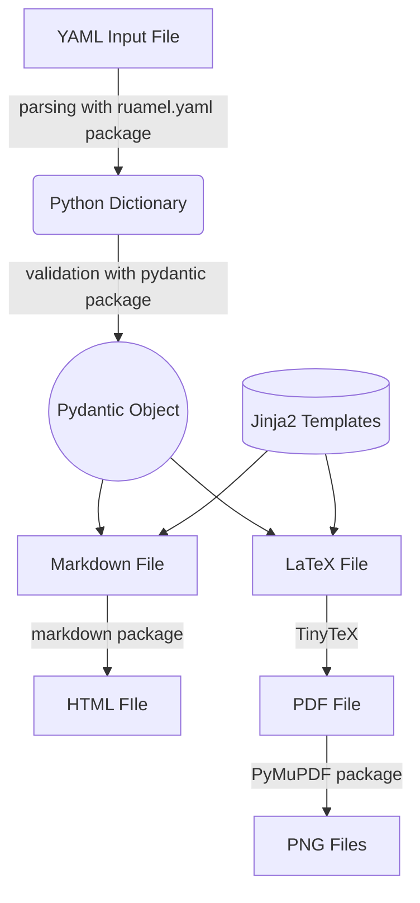

# Developer Guide

This document provides everything you need to know about the development of RenderCV.

## Getting Started

1. Ensure that you have Python version 3.10 or higher.

2. Then, clone the repository recursively (because TinyTeX is being used as a submodule) with the following command.
```bash
git clone --recursive https://github.com/sinaatalay/rendercv.git
```

3. Go to the `rendercv` directory.
```bash
cd rendercv
```

4. Create a virtual environment.
```bash
python -m venv .venv
```

5. Activate the virtual environment.

    === "Windows (PowerShell)"
        ```powershell
        .venv\Scripts\Activate.ps1
        ```
    === "MacOS/Linux"
        ```bash
        source .venv/bin/activate
        ```

6. Install the dependencies.
```bash
pip install .[docs,tests,dev]
```

## How RenderCV works?

The flowchart below illustrates the general operations of RenderCV. A detailed documentation of the source code is available in the [reference](reference/index.md).



## Writing Documentation

The documentation's source files are located in the `docs` directory and it is built using the `mkdocs` package. To work on the documentation and see the changes in real-time, run the following command.

```bash
mkdocs serve
```

## Testing

After updating the code, all tests should pass. To run the tests, use the following command.

```bash
pytest
```

### A note about `testdata` folder

In some of the tests:

- RenderCV generates an output with a sample input.
- Then, the output is compared with a reference output, which has been manually generated and stored in `testdata`. If the files differ, the tests fail.


When the `testdata` folder needs to be updated, it can be manually regenerated by setting `update_testdata` to `True` in `conftest.py` and running the tests.

Whenever the `testdata` folder is generated, the files should be reviewed manually to ensure everything works as expected.