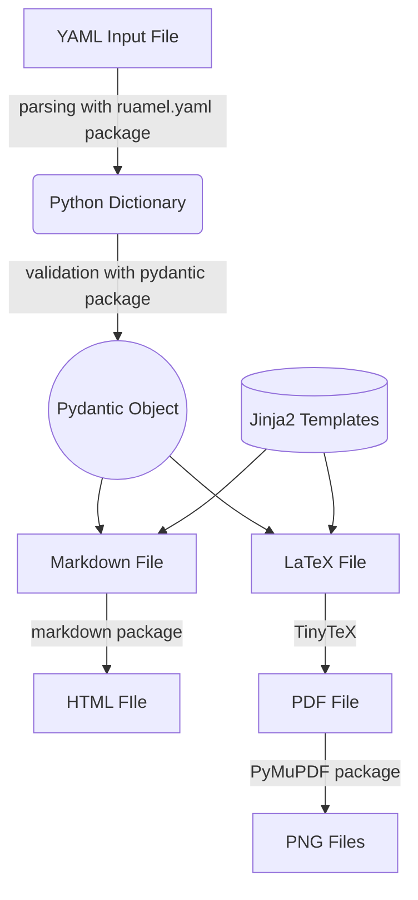

# Developer Guide

This document provides everything you need to know about the development of RenderCV.

## Getting Started

1. Ensure that you have Python version 3.10 or higher.

2. Then, clone the repository recursively (because TinyTeX is being used as a submodule) with the following command.
```bash
git clone --recursive https://github.com/sinaatalay/rendercv.git
```

3. Go to the `rendercv` directory.
```bash
cd rendercv
```

4. Create a virtual environment.
```bash
python -m venv .venv
```

5. Activate the virtual environment.

    === "Windows (PowerShell)"
        ```powershell
        .venv\Scripts\Activate.ps1
        ```
    === "MacOS/Linux"
        ```bash
        source .venv/bin/activate
        ```

6. Install the dependencies.
```bash
pip install --editable .[docs,tests,dev]
```

## How RenderCV works?

The flowchart below illustrates the general operations of RenderCV. A detailed documentation of the source code is available in the [reference](reference/index.md).



## Writing Documentation

The documentation's source files are located in the `docs` directory and it is built using the `mkdocs` package. To work on the documentation and see the changes in real-time, run the following command.

```bash
mkdocs serve
```

### Updating the examples and the JSON Schema

The example entry images found in the [Structure of the YAML input file](user_guide/structure_of_the_yaml_input_file.md), the `examples` folder, and the JSON Schema `schema.json` are generated using the script `docs/update_rendercv_files.py`. To update these files, run `update_rendercv_files.py` with the following command.

```bash
python docs/update_rendercv_files.py
```

## Testing

After updating the code, all tests should pass. To run the tests, use the following command.

```bash
pytest
```

### A note about `testdata` folder

In some of the tests:

- RenderCV generates an output with a sample input.
- Then, the output is compared with a reference output, which has been manually generated and stored in `testdata`. If the files differ, the tests fail.


When the `testdata` folder needs to be updated, it can be manually regenerated by setting `update_testdata` to `True` in `conftest.py` and running the tests.

Whenever the `testdata` folder is generated, the files should be reviewed manually to ensure everything works as expected.


## Frequently Asked Questions (FAQ)

### How can I add a new social network to RenderCV?

To add a new social network to RenderCV, go to the `rendercv/data_models.py` file and follow these steps:

1. Append the social network name (for example, "Facebook") to the `SocialNetworkName` type.
2. If necessary, implement its username validation in the `SocialNetwork.check_username` method.
3. Implement its URL generation using the `SocialNetwork.url` method. If the URL can be generated by appending the username to a hostname, only update `url_dictionary`.
4. Finally, include the $\LaTeX$ icon of the social network to the `icon_dictionary` in the `CurriculumVitae.connections` method. RenderCV uses the [`fontawesome5`](https://ctan.org/pkg/fontawesome5?lang=en) package. The available icons can be seen [here](https://fosszone.csd.auth.gr/CTAN/fonts/fontawesome5/doc/fontawesome5.pdf).

Then, the tests should be implemented for the new social network with the following steps:

1. Go to `tests/test_data_models.py` and update `test_social_network_url` accordingly.
2. Go to `tests/conftest.py` and add the new social network to `rendercv_filled_curriculum_vitae_data_model`.
3. Set `update_testdata` to `True` in `conftest.py` and run the tests to update the `testdata` folder.
4. Review the updated `testdata` folder manually to ensure everything works as expected. Then, set `update_testdata` to `False` and push the changes.
