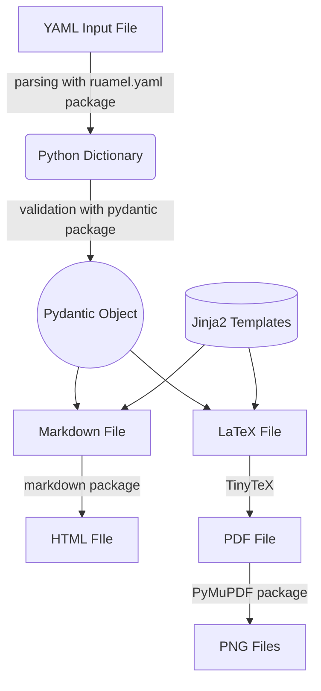

# Developer Guide

All contributions to RenderCV are welcome!

The source code is thoroughly documented and well-commented, making it an enjoyable read and easy to understand. Also, a flowchart is provided below to help you understand how RenderCV works.

## Getting Started

1. Ensure that you have Python version 3.10 or higher.
2. Install [Hatch](https://hatch.pypa.io/latest/), as it is the project manager for RenderCV. The installation guide for Hatch can be found [here](https://hatch.pypa.io/latest/install/#installation).
3. Clone the repository recursively (because TinyTeX is being used as a submodule) with the following command.
    ```bash
    git clone --recursive https://github.com/sinaatalay/rendercv.git
    ```
4. Go to the `rendercv` directory.
    ```bash
    cd rendercv
    ```
5. RenderCV uses three virtual environments:
    -  `default`: For the development. It contains packages like [Ruff](https://github.com/astral-sh/ruff), [Black](https://github.com/psf/black), etc.
    -  `docs`: For building the documentation.
    -  `test`: For testing RenderCV.
    
    Create the virtual environments with the following commands.
    
    ```bash
    hatch env create default
    hatch env create docs
    hatch env create test
    ```

6. To use the virtual environments, either

    - Activate one of the virtual environments with the following command.
        ```bash
        hatch shell default
        ```
    
    - Select one of the virtual environments in your Integrated Development Environment (IDE).

        === "Visual Studio Code"

            - Press `Ctrl+Shift+P`.
            - Type `Python: Select Interpreter`.
            - Select one of the virtual environments created by Hatch.

        === "Other"

            To be added.


## How RenderCV works?

The flowchart below illustrates the general operations of RenderCV. A detailed documentation of the source code is available in the [reference](../reference/index.md).



## Available Commands

These commands are defined in the [`pyproject.toml`](https://github.com/sinaatalay/rendercv/blob/main/pyproject.toml) file.

- Format the code with [Black](https://github.com/psf/black):
    ```bash
    hatch run default:format
    ```
- Lint the code with [Ruff](https://github.com/astral-sh/ruff):
    ```bash
    hatch run default:lint
    ```
- Sort the imports with [isort](https://github.com/timothycrosley/isort/):
    ```bash
    hatch run default:sort-imports
    ```
- Run the tests:
    ```bash
    hatch run test:run
    ```
- Run the tests and generate a coverage report:
    ```bash
    hatch run test:run-and-report
    ```
- Start the development server for the documentation:
    ```bash
    hatch run docs:serve
    ```
- Build the documentation:
    ```bash
    hatch run docs:build
    ```
- Deploy the documentation to GitHub Pages:
    ```bash
    hatch run docs:deploy
    ```
- Update [schema.json](https://github.com/sinaatalay/rendercv/blob/main/schema.json):
    ```bash
    hatch run docs:update-schema
    ```
- Update [`examples`](https://github.com/sinaatalay/rendercv/tree/main/examples) folder:
    ```bash
    hatch run docs:update-examples
    ```
- Update figures of the entry types in the "[Structure of the YAML Input File](https://docs.rendercv.com/user_guide/structure_of_the_yaml_input_file/)":
    ```bash
    hatch run docs:update-entry-figures
    ```

## About [`pyproject.toml`](https://github.com/sinaatalay/rendercv/blob/main/pyproject.toml)

[`pyproject.toml`](https://github.com/sinaatalay/rendercv/blob/main/pyproject.toml) contains all the metadata, dependencies, and tools required for the project. Please read through the file to understand the project's technical details.