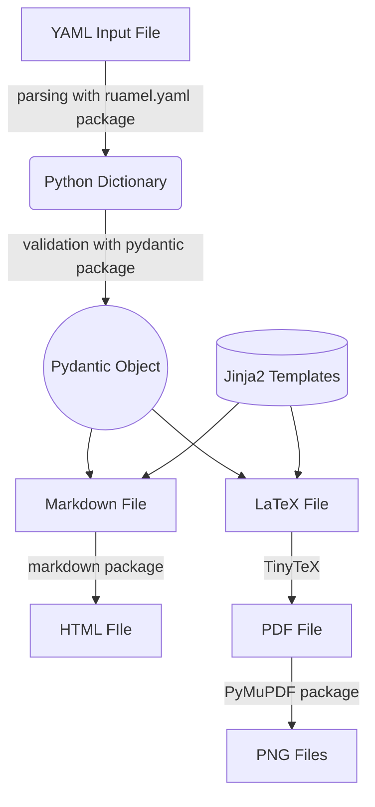

# Developer Guide

All contributions to RenderCV are welcome!

The source code is thoroughly documented and well-commented, making it an enjoyable read and easy to understand. Also, a flowchart is provided below to help you understand how RenderCV works.

## Getting Started

1. Ensure that you have Python version 3.10 or higher.

2. Then, clone the repository recursively (because TinyTeX is being used as a submodule) with the following command.
```bash
git clone --recursive https://github.com/sinaatalay/rendercv.git
```

3. Go to the `rendercv` directory.
```bash
cd rendercv
```

4. Create a virtual environment.
```bash
python -m venv .venv
```

5. Activate the virtual environment.

    === "Windows (PowerShell)"
        ```powershell
        .venv\Scripts\Activate.ps1
        ```
    === "MacOS/Linux"
        ```bash
        source .venv/bin/activate
        ```

6. Install the dependencies.
```bash
pip install --editable ".[docs,tests,dev]"
```

## How RenderCV works?

The flowchart below illustrates the general operations of RenderCV. A detailed documentation of the source code is available in the [reference](../reference/index.md).



## About [`pyproject.toml`](https://github.com/sinaatalay/rendercv/blob/main/pyproject.toml)

[`pyproject.toml`](https://github.com/sinaatalay/rendercv/blob/main/pyproject.toml) contains all the metadata, dependencies, and tools required for the project. Please read through the file to understand the project's technical details.