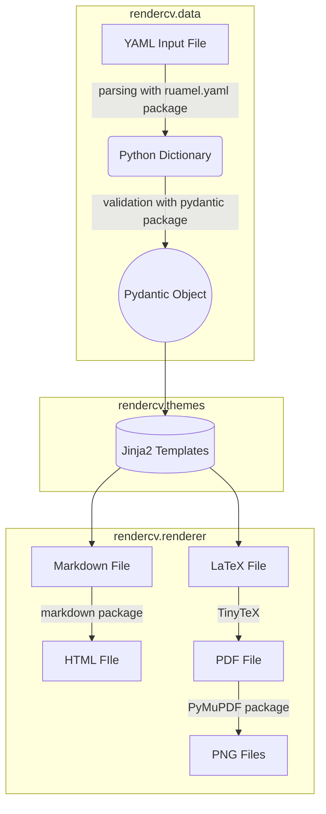

---
hide:
  - toc
---

# API Reference

::: rendercv

In this section, you can find how RenderCV's components are structured and how they interact with each other. The flowchart below illustrates the general operations of RenderCV.

- [`cli`](cli/index.md) package contains the command-line interface (CLI) related code for RenderCV.
    - [`commands.py`](cli/commands.md) module contains the CLI commands.
    - [`printer.py`](cli/printer.md) module contains the functions and classes that are used to print nice-looking messages to the terminal.
    - [`utilities.py`](cli/utilities.md) module contains utility functions that are required by the CLI.
- [`data`](data/index.md) package contains classes and functions to parse and validate a YAML input file.
    - [`models`](data/models/index.md) package contains the Pydantic data models, validators, and computed fields that are used in RenderCV.
        - [`computers.py`](data/models/computers.md) module contains functions that compute some properties based on the input data.
        - [`base.py`](data/models/base.md) module contains the base data model for the other data models.
        - [`entry_types.py`](data/models/entry_types.md) module contains the data models of the available entry types in RenderCV.
        - [`curriculum_vitae.py`](data/models/curriculum_vitae.md) module contains the data model of the `cv` field of the input file.
        - [`design.py`](data/models/design.md) module contains the data model of the `design` field of the input file.
        - [`locale_catalog.py`](data/models/locale_catalog.md) module contains the data model of the `locale_catalog` field of the input file.
        - [`rendercv_data_model.py`](data/models/rendercv_data_model.md) module contains the `RenderCVDataModel` data model, which is the main data model that defines the whole input file structure.
    - [`generator.py`](data/generator.md) module contains the functions for generating the JSON Schema of the input data format and a sample YAML input file.
    - [`reader.py`](data/reader.md) module contains the functions that are used to read the input files. 
- [`renderer`](renderer/index.md) package contains the necessary classes and functions for generating the output files from the `RenderCVDataModel` object.
    - [`renderer.py`](renderer/renderer.md) module contains the necessary functions for rendering $\\LaTeX$, PDF, Markdown, HTML, and PNG files from the data model.
    - [`templater.py`](renderer/templater.md) module contains the necessary classes and functions for templating the $\\LaTeX$ and Markdown files from the data model.
- [`themes`](themes/index.md) package contains the built-in themes of RenderCV.
    - [`common_options.py`](themes/common_options.md) module contains some standard data models for design options.
    - [`classic`](themes/classic.md) package contains the `classic` theme templates and data models for its design options.
    - [`engineeringresumes`](themes/engineeringresumes.md) package contains the `engineeringresumes` theme templates and data models for its design options.
    - [`sb2nov`](themes/sb2nov.md) package contains the `sb2nov` theme templates and data models for its design options.
    - [`moderncv`](themes/moderncv.md) package contains the `moderncv` theme templates and data models for its design options.
