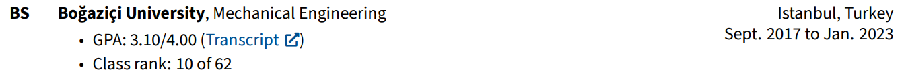
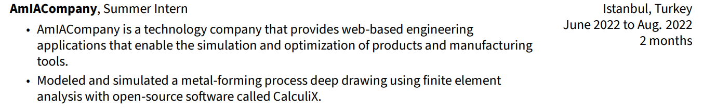
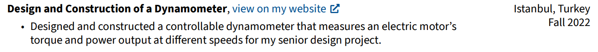

# RenderCV: User Guide

After you've installed RenderCV with

```bash
pip install rendercv
```

you can start rendering your CV.

Firstly, go to the directory where you want your CV files located and run:

```bash
rendercv new "Your Full Name"
```

This will create a YAML input file for RenderCV called `Your_Name_CV.yaml`. Open this generated file in your favorite IDE and start editing. It governs all the features of RenderCV.

!!! tip

    To maximize your productivity while editing the input YAML file, set up RenderCV's JSON Schema in your IDE. It will validate your inputs on the fly and give auto-complete suggestions.

    === "Visual Studio Code"

        1.  Install [YAML language support](https://marketplace.visualstudio.com/items?itemName=redhat.vscode-yaml) extension.
        2.  Then the Schema will be automatically set up because the file ends with `_CV.yaml`.

    === "Other"

        1.  Ensure your editor of choice has support for YAML schema validation.
        2.  Add the following line at the top of `Your_Name_CV.yaml`:

            ``` yaml
            # yaml-language-server: $schema=https://github.com/sinaatalay/rendercv/blob/main/schema.json?raw=true
            ```

After you're done editing your input file, run the command below to render your CV:
```bash
rendercv render Your_Name_CV.yaml
```

## Entry Types

There are five entry types in RenderCV:

1.  *EducationEntry*
2.  *ExperienceEntry*
3.  *NormalEntry*
4.  *OneLineEntry*
5.  *PublicationEntry*

The whole CV consists of these entries. The table below shows what sections of the input file use which entry type.

| YAML section                   | Entry Type                       |
| ------------------------------ | -------------------------------- |
| `education`                  | *EducationEntry*               |
| `work_experience`            | *ExperienceEntry*              |
| `academic_projects`          | *NormalEntry*                  |
| `publications`               | *PublicationEntry*             |
| `certificates`               | *NormalEntry*                  |
| `skills`                     | *OneLineEntry*                 |
| `test_scores`                | *OneLineEntry*                 |
| `personal_projects`          | *NormalEntry*                  |
| `extracurricular_activities` | *ExperienceEntry*              |
| `custom_sections`            | **They can be any of the five!** |

!!! info
    Note that *EducationEntry* is not necessarily for education entries only. It's one of the five entry designs that RenderCV offers, and it could be used for anything (see [custom sections](http://user_guide.md#custom_sections)). *EducationEntry* just happens to be its name. The same goes for other entries, too.

### *EducationEntry*

```yaml
institution: Boğaziçi University
url: https://boun.edu.tr
area: Mechanical Engineering
study_type: BS
location: Istanbul, Turkey
start_date: "2017-09-01"
end_date: "2023-01-01"
transcript_url: https://example.com
gpa: 3.10/4.00
highlights:
- "Class rank: 10 of 62"

```

which renders into



### *ExperienceEntry*

```yaml
company: AmIACompany
position: Summer Intern
location: Istanbul, Turkey
url: https://example.com
start_date: "2022-06-15"
end_date: "2022-08-01"
highlights:
- AmIACompany is a technology company that provides web-based engineering
  applications that enable the simulation and optimization of products and
  manufacturing tools.
- Modeled and simulated a metal-forming process deep drawing using finite element
  analysis with open-source software called CalculiX.
```

which renders into



### *NormalEntry*

```yaml
name: Design and Construction of a Dynamometer
location: Istanbul, Turkey
date: Fall 2022
highlights:
- Designed and constructed a controllable dynamometer that measures an electric
  motor's torque and power output at different speeds for my senior design project.
url: https://example.com

```

which renders into



### *OneLineEntry*
```yaml
name: Programming
details: C++, C, Python, JavaScript, MATLAB, Lua, LaTeX
```

which renders into


### *PublicationEntry*

```yaml
title: Phononic band gaps induced by inertial amplification in periodic media
authors:
- Author 1
- John Doe
- Author 3
journal: Physical Review B
doi: 10.1103/PhysRevB.76.054309
date: "2007-08-01"
cited_by: 243
```

which renders into


## Custom Sections

Custom sections with custom titles can be created. Each custom section will be an object that looks like this:

```yaml
title: My Custom Section
entry_type: OneLineEntry
entries:
- name: Testing custom sections
  details: Wohooo!
- name: This is a
  details: OneLineEntry!
```

And `custom_sections` part of the data model will be a list of customs section objects that look like this:
```yaml
custom_sections:
- title: My Custom Section
  entry_type: OneLineEntry
  entries:
    - name: Testing custom sections
      details: Wohooo!
    - name: This is a
      details: OneLineEntry!
- title: My Other Custom Section
  entry_type: EducationEntry
  entries:
    - institution: Hop!
      area: Hop!
      study_type: HA
      highlights:
      - "There are only five types of entries: *EducationEntry*, *ExperienceEntry*,
        *NormalEntry*, *OneLineEntry*, and *PublicationEntry*."
      - This is an EducationEntry!
      start_date: "2022-06-15"
      end_date: "2022-08-01"
```

Each custom section needs to have an entry type, and entries should be adjusted according to the entry type selection.

!!! note

    Some entry types use links, and all the links have a text placeholder. That placeholder can be changed with `link_text` setting as shown below:
    ```yaml
    title: My Third Custom Section
    entry_type: ExperienceEntry
    link_text: My Link Text
    entries:
    - company: Hop!
      position: Hop!
      date: My Date
      location: My Location
      url: https://example.com
      highlights:
      - I think this is really working. This is an *ExperienceEntry*!
    ```


